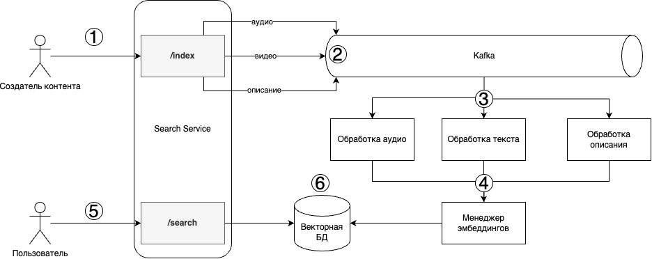
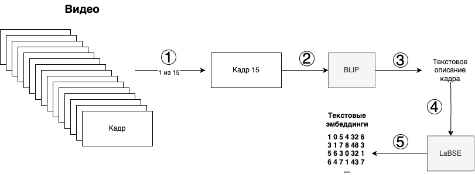
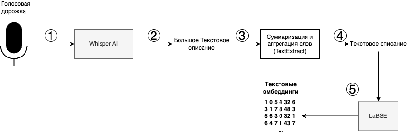
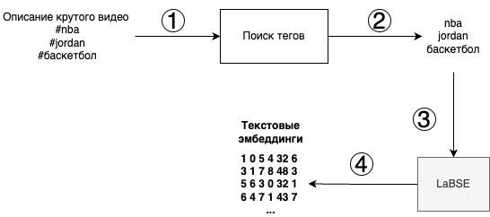

# Текстовый поиск по медиаконтенту

## Демонстрация

**ВАЖНО: поиск лучше работает на более точных запросах (больше слов)**

### Простой запрос

https://github.com/Collabse-LCT-2024/main/assets/18398543/b71ef794-5d38-4cb3-9899-fbcf2fb31986

### Запрос посложнее

https://github.com/Collabse-LCT-2024/main/assets/18398543/6cea436a-877c-420d-bfe1-e19cd8af9c3b

### Работа с опечатками

https://github.com/Collabse-LCT-2024/main/assets/18398543/c2be51ae-7a38-4761-89e0-1f0fd922258f

## Главные особенности

- Поддержка мультиязычных запросов (лучше всего работает на английском и русском, но можно и на других языках)
- Поиск работает максимально за 0,4 секунды (на 20% быстрее требуемой скорости)
- Индексация видео:
  - Без GPU: до 6 минут (при условии длинного видео), 2 VM с 4vCPU и 16 GB RAM
  - С GPU: до 1 минуты, NVIDA 2070 Super RTX
- На основе сервиса можно **значительно улучшить рекомендательную систему без дополнительных ML/DL подходов**
  - За счет понимания понимания расположения видео относительно друг друга
  - Примеры сценариев использования:
    - После запроса "мужчина в белой рубашке танцует" могут рекомендоваться другие видео с танцующими мужчинами, а потом и с танцами
    - Формирование практические советов по развитию контента для конкретного автора на основе статистики сервиса (на основе [LLM](https://www.cloudflare.com/en-gb/learning/ai/what-is-large-language-model/) и [RAG](https://www.promptingguide.ai/research/rag))
    - Улучшение рекомендаций на основе понимания "маршрута" пользователя по многомерном пространстве видео (на основе статистики и информации о положении видео в пространстве векторов)

## Ссылки

- Ссылка на прототип
  - [Индексация](http://87.242.93.108/api/events/openapi)
  - [Поиск](http://87.242.93.108:3001/docs)
- Репозитории:
  - [gateway-api](https://github.com/Collabse-LCT-2024/gateway-api) - индексация видео (путь /index)
  - [vector-search-api](https://github.com/Collabse-LCT-2024/vector-search-api) - поиск по базе данных (путь /search/text)
  - [video-processing-service](https://github.com/Collabse-LCT-2024/video-processing-service) - Обработка каждого топика Kafka в рамках индексирования видео:
    * звук ([ветка wisper](https://github.com/Collabse-LCT-2024/video-processing-service/tree/wisper))
    * видео ([ветка aggregator](https://github.com/Collabse-LCT-2024/video-processing-service/tree/aggregator))
    * описание ([ветка tags](https://github.com/Collabse-LCT-2024/video-processing-service/tree/tags))
  - [embedding-aggregator-service](https://github.com/Collabse-LCT-2024/embedding-aggregator-service) - аггрегация полученных эмбеддингов в базу данных, проверка на наличие других эмбеддингов по видео и их усреднение

## Решение

Общая диаграмма решения описана ниже:

1. Создатель контента отправляет ссылку на видео и описание к запросу /index
2. Ссылка на видео отправляется в 3 "топика" в брокер сообщений Kafka. Каждый "топик" посвящен обработке каждой из частей видео: видео, аудио и текстового описания
3. "Воркеры" (сервисы, ожидающие новых поступлений в свой "топик") обрабатывают каждую из частей параллельно и возвращают эмбеддинги (численные представления текстовой информации)
4. Менеджер эмбеддингов ищет существующие эмбеддинги в базе данных, усредняет (если они нашлись) и записывает их в векторную базу данных
5. Пользователь использует метод /search, где задает текстовый запрос
6. Текстовый запрос переводится в эмбеддинг, после чего возвращается топ-10 наиболее близких к нему запросов из векторной базы даннных 

## Индексация
Процесс индексации состоит из трех главных состовляющих. Предлагаю подбробно изучить каждый из них 

### Видео

#### Решение

Рассмотрим процесс обработки видео:

1. Из видео достается каждый 15 кадр. Все кадры не обрабатывались из-за ограничения в вычислительных мощностях. Это значение может быть как уменьшено, так и увеличено
2. Эти кадры "прогоняются" пачками по 8 кадров через модель [BLIP](https://huggingface.co/docs/transformers/en/model_doc/blip) (модель с открытым исходным кодом) для конвертации в текст
3. В результате получается текст длиной 20 токенов (~25 слов). Большее количество токенов может быть установлено, но не реализовано из-за ограничения в вычислительных мощностях. Это значение может быть как уменьшено, так и увеличено
4. Далее текст проходит через модель [LaBSE](https://huggingface.co/sentence-transformers/LaBSE) (модель на основе BERT с открытым исходным кодом), которая создает языко-нейтральные эмбеддинги с поддержкой 109 языков
5. В результате получается эмбеддинг (набор дробных чисел, формирующих вектор в многомерном пространстве), который далее передается для [хранения](#хранение).

#### Что еще пытались сделать?

* **Поиск по кадрам** - отказались из-за роста сложности поиска в геометрической прогрессии
* **Усреднение кадров** - отказались из-за высокой степени шума (средние значения "цепляли" другие видео, поэтому в поиске были одни и те же видео). Пытались усреднять по:
  * среднему арифметическому
  * среднему взвешенному (вес - это качество работы модели)
  * среднему усеченному
* **Использование CLIP в качестве модели для image-to-text** - отказались по двум причинам:
1. Слишком примитивный текст (пользователь не будет писать столь точный запрос именно в этой лексике; синонимы в поиске не воспринимаются)
2. Результат работы модели - эмбеддинг, а не текст. Это накладывает ограничения на обработку описания и транскрипции аудио (эмбеддинги от разных моделей при едином поиске отрабатывают некорректно)

### Аудио

#### Решение

Теперь рассмотрим итоговое решение обработки аудио:

1. Видео подается на вход модели middle [Whisper AI](https://github.com/openai/whisper) (модель от OpenAI с открытым исходным кодом), которая достает голосовую дорожку и превращает ее в текст
2. В результате получается текст произвольной длины с большим количеством предложений, в которой предложения могут быть нестабильного размера
3. С помощью модели [TextRank](https://web.eecs.umich.edu/~mihalcea/papers/mihalcea.emnlp04.pdf) (алгоритм описан в научной статье) получаем краткую версию текста
4. В итоге получаем короткий текст, который без потери качества и важных смыслов.
5. Текст отправляется в модель [LaBSE](https://huggingface.co/sentence-transformers/LaBSE) (модель на основе BERT с открытым исходным кодом), которая создает языко-нейтральные эмбеддинги с поддержкой 109 языков и далее передается для [хранения](#хранение).

#### Что еще пытались сделать?

* **Использовали более большие версии Whisper** - отказались из-за сильного прироста по времени работы и низкого прироста качества
* **Использовали входной порог на обработку фоновой музыки по умолчанию** - отказались из-за большого количества шумов, опимизировали 70-80% шумов
* **Переход в эмбеддинги без суммаризации** - низкое качество поиска из-за разности эмбеддингов для текста разной размерности (даже при наличии одних и тех же слов короткий и длинный тексты имеют диаметрально противоположные эмбеддинги)

### Описание

#### Решение

Давайте рассмотрим итоговое решение:

1. Из полей запроса достается описание видео
2. На основе регулярного выражения из описания достаются теги
3. Все теги передаются в модель [LaBSE](https://huggingface.co/sentence-transformers/LaBSE) (модель на основе BERT с открытым исходным кодом), которая создает языко-нейтральные эмбеддинги с поддержкой 109 языков.
4. Эмбеддинги передается для [хранения](#хранение)

#### Что еще пытались сделать?

* Создание тегов по описанию - не успели, но планируем сделать, если попадем в топ-10 :)

## Хранение

В качестве хранения использовалось три подхода

- Mongo - NoSQL база данных документов
  - отказались из-за медленной скорости поиска по тексту
- [Weaviate](https://github.com/weaviate/weaviate) - векторная база данных с открытым исходным кодом
  - отказались из-за отсутствия поиска по тексту и медленному движку поиска

### Итоговый выбор

[Qdrant](https://github.com/qdrant/qdrant) - векторная cloud-native база данных со встроенным движком поиска по схожести векторов
  - Обеспечивает до 4 раз больше Request Per Second (RPS) и до 40 раз быстрее поиск по векторам
